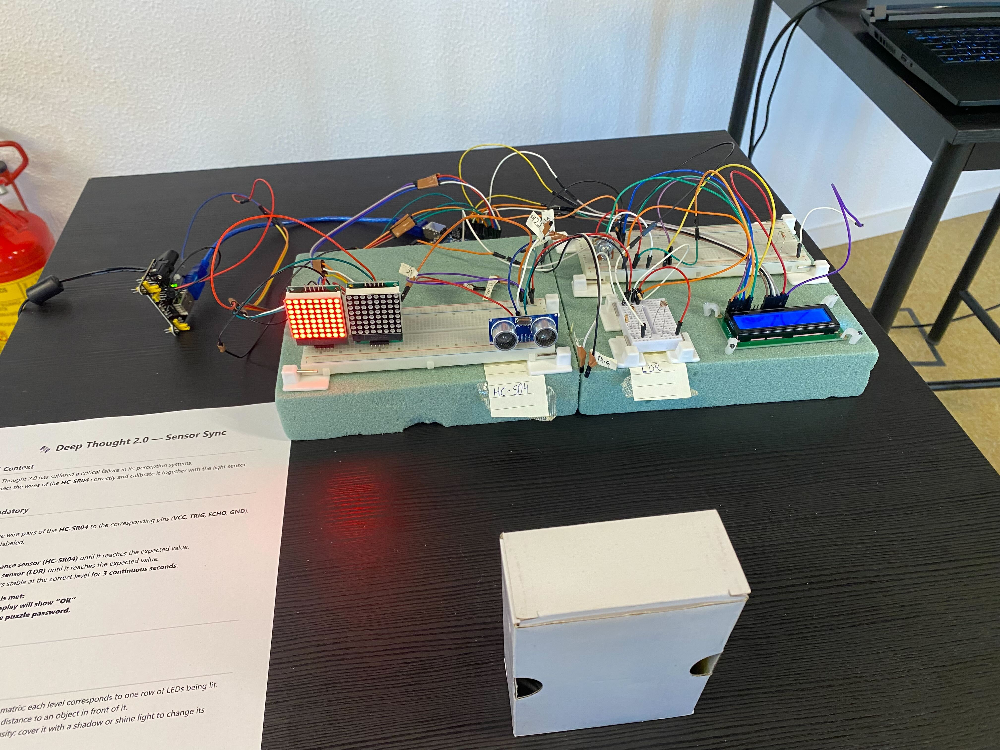
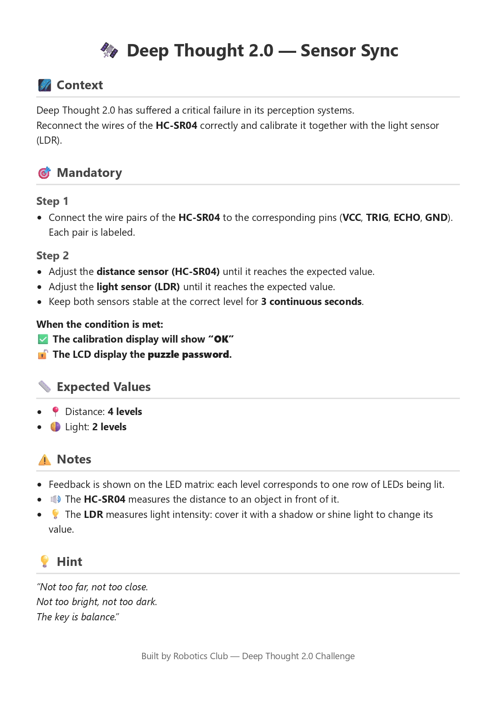

# 🛰️ SensorSyncPuzzle — Deep Thought 2.0 Challenge

## 📌 About the Project

## 📷 Puzzle Setup




**SensorSyncPuzzle** is an Arduino-based escape room puzzle developed for the **Robotics Club of School 42**.

It was created as part of a welcoming event for new Common Core students, where participants faced a series of physical and logical challenges to unlock passwords and complete the final mission.

This puzzle combines **light and distance calibration**, LED matrix feedback, and an LCD password reveal system.

---

## 🌌 Escape Room Context

This puzzle was created for a Robotics Club event at School 42 to welcome new Common Core students.

Participants were divided into teams and had **twenty minutes** to solve a sequence of interconnected challenges, each one revealing a password needed to complete the final mission.

### Narrative

In the story of the escape room, the spaceship *Heart of Infinity* is carrying **Deep Thought 2.0**, the most powerful computer in the universe — built to uncover the meaning behind the mysterious number **42**.

But something goes wrong: Deep Thought 2.0 fragments into corrupted subsystems and locks itself down, while the ship is pulled into a black hole.

Your mission is to restore one of its broken perception modules by synchronizing its sensors before time runs out.

Solving this puzzle reveals one of the secret passwords required to save the ship and finish the escape room.

#### Subject (robotic challenge)




---

## 🎯 Puzzle Objective

Players must synchronize **two sensors at the same time**:

- 📍 **Distance Sensor (HC-SR04)** → must reach **Level 4**
- 🌗 **Light Sensor (LDR)** → must reach **Level 2**

When both conditions are met and held steady for **3 seconds**, the system confirms success:

✅ LED matrices display **“OK”**  
🔓 LCD reveals the password

[▶️ Watch the puzzle in action](media/video.MOV)
---

## 🧩 Hardware Used

| Component | Description |
|----------|-------------|
| Arduino UNO | Main controller |
| HC-SR04 | Ultrasonic distance sensor |
| LDR | Light intensity sensor |
| 2x LED Matrix (MAX7219) | Visual level feedback |
| LCD 16x2 | Displays the final password |
| Resistors + Wires | Circuit assembly |

---

## 💡 How Feedback Works

### LED Matrices as Level Indicators

Each sensor has its own LED matrix:

- Rows light up like a “progress bar”
- More rows = closer distance / stronger light

Players must adjust:

- Object distance in front of the HC-SR04  
- Light exposure over the LDR  

Until both sensors match the expected levels.

---

## ⚙️ Success Condition

The Arduino continuously checks:

```cpp
if(goalDis && goalLuz)
```

Then requires the position to remain stable for:

- ⏳ 2000ms (~2 seconds)

Once confirmed:

- Matrices show **OK**
- LCD prints the escape room password
- Puzzle locks in success state forever

---

## 🔓 Password Reveal

After calibration, the LCD displays the password with a glitch-style animation:

```cpp
showPassword("ATmega328P");
```

Example output:

```
Your code:
ATmega328P
```

---

## 🏫 Developed For

This project was designed for the **42 Robotics Club Escape Room Event**, welcoming new students through collaborative challenges involving hardware, logic, and teamwork.

---
